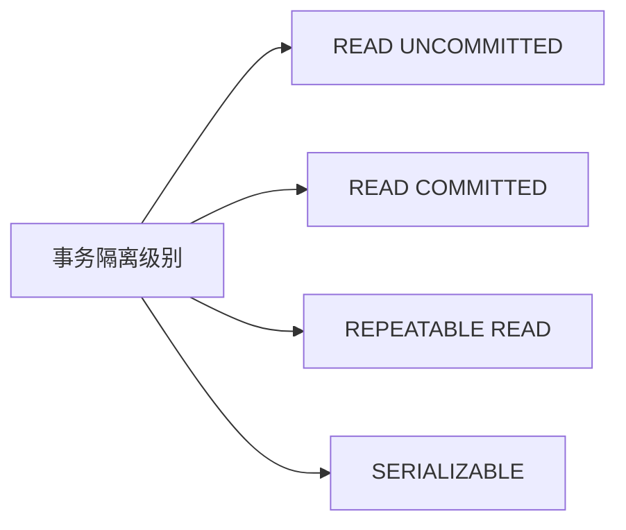
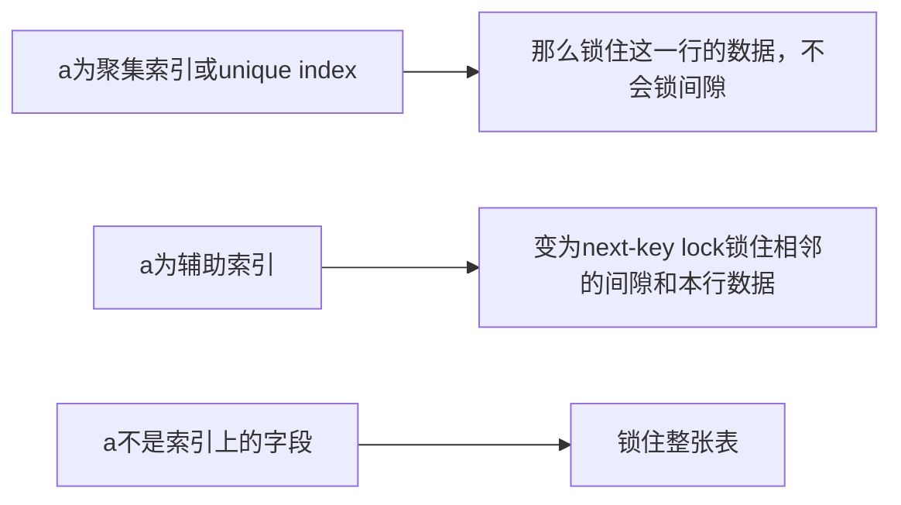

## 一个Bug引发的死锁
最近有用户反映，系统时不时会出现报错的现象。登陆生产环境查看日志，发现MySQL出现了死锁。根据报错信息排查，在生产环境发现了如下代码。
```python
session.query(TblMsg.id).filter(TblMsg.key == key).with_for_update()

obj_msg = TblMsg(
    group_id=group_id,
    key=key,
    sep=sep
)
session.add(obj_msg)
session.commit()
```
为了使逻辑更加清晰，代码我已经简化过了。经常运行到会话提交事务时，就产生死锁。下面我们就来一步步分析，产生死锁的原因以及解决策略。
<!--more-->
## InnoDB行锁的种类
首先，我们来看看InnoDB中行锁的种类。

Recodrd Lock: 行锁，每行级别加锁。
Gap Lock: 间隙锁，锁住一个范围，但并不包括要锁的那个值。
Next key Lock： 行锁和间隙锁的结合，即锁住范围也锁住要锁的值，是Gap Lock和Next key Lock的结合。
## 事务的隔离级别
提及到锁，那么就一定离不开事务的隔离级别。

这里我们着重关注`READ COMMITED`和`REPEATABLE READ`，MySQL默认的事务隔离级别为`REPEATABLE READ`。我们都知道在`REPEATABLE READ`这个隔离级别下，理论上是会出现幻读的。为了解决这个问题`InnoDB`引入了间隙锁这个概念。
## Gap Lock
Gap Lock在RR隔离级别上才会生效，其他事务隔离级别不会出现Gap Lock。间隙锁的出现还和索引有关系。列如`update xxx set a=1 where a=2;`这个语句。

现在主要来看看a为辅助索引的情况，借此来研究Gap Lock的技术细节。首先我们创建一张表。
```sql
create table `test_gap_lock`(
    id unsigned int primary key,
    number int,
    key `key_number` ("number"),
);

然后在db中插入数据
INSERT INTO `test_gap_lock`(
  `id`, `number`
)VALUE
  (1,2),
  (3,4),
  (6,5),
  (8,5),
  (10,5),
  (13,11);
```
在辅助索引`a`上存在的next-key lock为(-∞, 2], (2, 4], (4, 5], (5, 11],(11, +∞)
现在我们启动两个session
```sql
# session 1
BEGIN ;
SELECT * from `test_gap_lock` WHERE number=4 FOR UPDATE ;
```

```sql
# session 2
INSERT INTO `test_gap_lock`(`id`, `number`) VALUE (100, 3); # 阻塞
INSERT INTO `test_gap_lock`(`id`, `number`) VALUE (5, 5); #阻塞
INSERT INTO `test_gap_lock`(`id`, `number`) VALUE (7, 5); #成功
```
现在来解释一下，因为number为辅助索引，现在手动给number为4的值加一把写锁时，会锁住4附近的间隙。即(2, 4]和(4, 5]这个区间。插入number值为3的行，在这个范围内，所以会阻塞住。

二、三次插入同样的值，第二次插入阻塞，第三次插入成功，则和索引的排列有关。在辅助索引中，如果索引上的值相同，那么则按照聚集索引的顺序进行排列。因为id=5的这次插入在id=3和id=6这两行数据之间，所以被阻塞住。而id=7的插入，不在这个范围内，所以能插入成功。
## 解决问题
有了上面的知识，这个Bug的产生的原因就显而易见了。在并发的条件下，sql的执行顺序可能产生一下的情况。
```sql
# session 1
session.query(TblMsg.id).filter(TblMsg.key == key).with_for_update()

# session 2
session.query(TblMsg.id).filter(TblMsg.key == key).with_for_update()

# session 1 阻塞
session.add(obj_msg)
session.commit()

# session 2 阻塞
session.add(obj_msg)
session.commit()
```
key为表上的一个二级索引，当手动加锁的时候，锁的性质变为NEXT-KEY Lock。不仅锁住`key`值，同时也锁住间隙。session 1锁住了相应的间隙，session 2也锁住了相应的间隙。如果这个时候session 1锁住的间隙，正好是session 2要插入的值。session 2锁住的间隙，是session 1要插入的值。就会出现死锁。

解决问题的办法很简单，有两种策略：
1、 使用Unique key或主键作为筛选条件，从next-key lock退化为recode lock。
2、 事务的隔离级别从RR退回到RC，或者手动设置参数关闭gap lock。这种更改最为简单，但可能出现幻读，所以需要确定幻读不会影响业务的正常运行。
