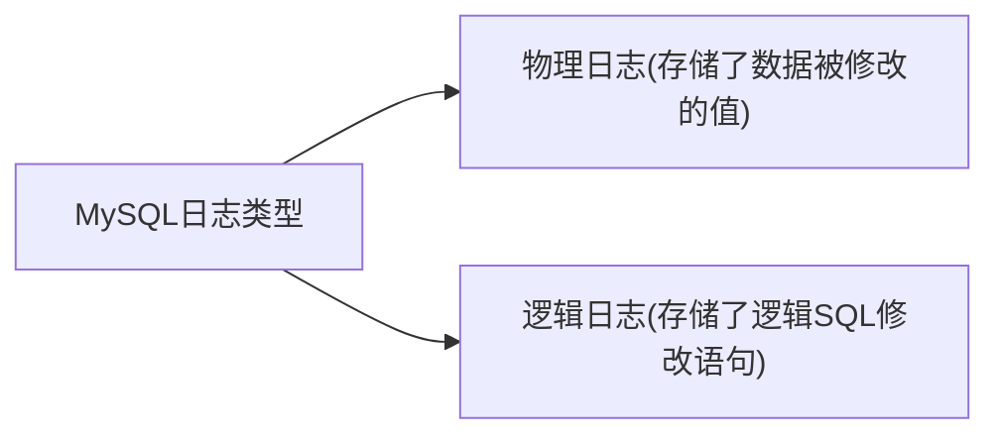
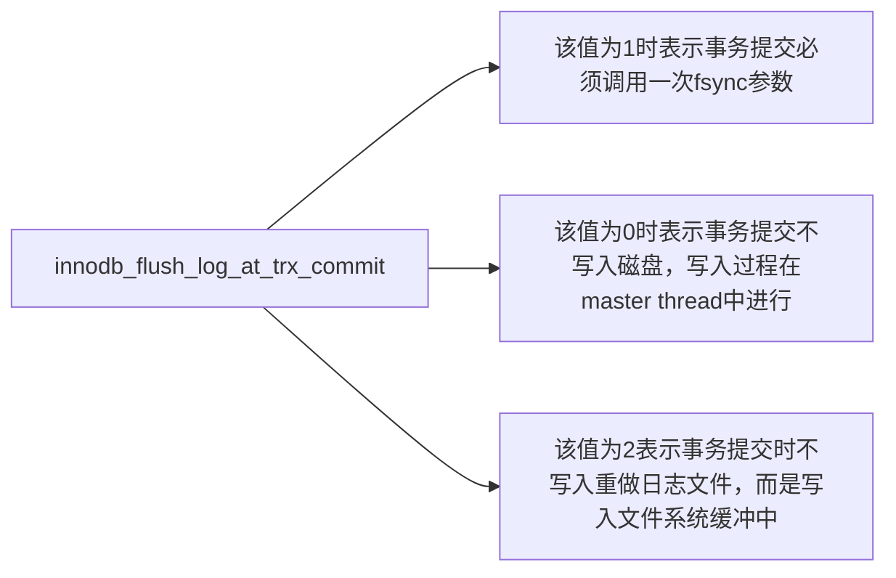

## 事务的四个特性
一致性、隔离性、原子性和持久性。
redo log用来保证事务的原子性和持久性。
undo log用来保证事务的一致性。

## 日志类型

redo log在数据库重启恢复的时候被使用，因为其属于物理日志的特性，恢复速度远快于逻辑日志。而我们经常使用的binlog就属于典型的逻辑日志。

## 为什么需要redo log？
InnoDB修改数据时是先将数据读到内存的缓冲池中修改，再刷新回磁盘。那么内存和磁盘不一致的数据就叫做脏页。InnoDB对脏页的处理不是每次生成脏页就将脏页刷新回磁盘，这样会产生海量的IO操作，严重影响InnoDB的处理性能。既然脏页与磁盘中的数据存在差异，那么如果在这期间DB出现故障就会造成数据的丢失。为了解决这个问题，redo log就应运而生了。

## 什么是redo log？
说白了，redo log就是存储了数据被修改后的值。当我们提交一个事务时，InnoDB会先去把要修改的数据写入日志，然后再去修改缓冲池里面的真正数据页。redo log本身也由两部分所构成即重做日志缓冲(redo log buffer)和重做日志文件(redo log file)。这样的设计同样也是为了调和内存与磁盘的速度差异。

## 什么叫做插入缓冲？
mysql数据是按聚集索引的顺序排列在磁盘，所以按照主键递增的顺序插入是非常快的。但是一张表上，一般来说还有很多二级索引。那么插入二级索引的时候，需要去寻找二级索引需要插入的位置。那么插入缓冲的作用就是，将要插入的数据合并的缓冲区里，然后一起插入数据库。

## master thread
```c
void master_thread(){
    goto loop
  loop:
  for(int i=0; i<10; i++){

    thread_sleep(1)
    日志缓冲刷新到磁盘(总是)
    如果每秒插入缓冲数目小于5：
      合并插入缓冲(可能发生)
    超过`innodb_max_dirty_pages_pct`:
      刷新100个脏页到磁盘(可能发生)
    如果没有活动:
      goto backgroup
  }
  如果io操作小200个:
    刷新100个脏页进磁盘
  超过`innodb_max_dirty_pages_pct`的90%:
    刷新100个脏页进磁盘
  else:
    刷新10个脏页进磁盘

  合并5个插入缓冲(总是)
  刷新undo log进磁盘(总是)
  删除无用的undo log页

  backgroup:
    {
      删除无用的undo页
      合并20个插入缓冲
      goto loop
    }
}
```

## LSN(Log Sequence Number)
日志序列号。
LSN占用8个字节，单调递增：

重做日志写入总量

checkpoint位置

页的版本

## checkpoint技术
checkpoint就是将缓冲池中的脏页刷回磁盘。

sharp checkpoint

fuzzy checkpoint

**可能发生checkpoint的情况:**

master thread checkpoint

flush_lru_list checkpoint

async/sync flush checkpoint

dirty page too much checkpoint

## 工作原理

InnoDB写入磁盘的策略可以通过`innodb_flush_log_at_trx_commit`这个参数来控制。

当该值为1时，当然是最安全的，但是数据库性能会受一定影响。

为0时性能较好，但是会丢失掉master thread还没刷新进磁盘部分的数据。

当该值为2时，当DB发生故障能恢复数据。但如果操作系统
也出现宕机，那么就会丢失掉，文件系统没有及时写入磁盘的数据。

这里说明一下，`innodb_flush_log_at_trx_commit`设为非0的值，并不是说不会在master thread中刷新日志了。master thread刷新日志是在不断进行的，所以redo log写入磁盘是在持续的写入

## 宕机恢复

DB宕机后重启，InnoDB会首先去查看数据页中的LSN的数值。这个值代表数据页被刷新回磁盘的LSN的大小。然后再去查看redo log的LSN的大小。如果数据页中的LSN值大说明数据页领先于redo log刷新回磁盘，不需要进行恢复。反之需要从redo log中恢复数据。

## 坏页
Redo log的存储都是以 块(block) 为单位进行存储的，每个块的大小为512字节。同磁盘扇区大小一致，可以保证块的写入是原子操作。

## 什么是undo log？
undo log用于数据库回滚操作和mvcc的版本读取。

undo log存储的是数据修改的操作，属于逻辑日志。

uodo 存放在数据库内部一个特殊的段(segment)中，这个段称为undo段。

因为undo属于逻辑日志，所以只是逻辑地将DB恢复到原来的样子。但数据结构和页本身在回滚之后可能大不相同。

## insert操作
对于非`uncommit read`隔离级别。undo log的Insert操作只会产生自己事务能见的log。完成后立即删除undo log。

## reuse机制
`InnoDB`不是给每一个事务分配一个undo log页，占用的空间太大了。当undo log页的可用空间小于四分之三的时候，就启动重用机制。一个页可以存放多个事务的undo log。

## update和delete操作
而对于DB的Update和Delete操作，则是先将数据标记为已删除。这是mvcc的要求，因为可能有其他事务正常使用。然后延时到purge线程中进行删除或更新。

## history list
history list是一个链表。按事务提交顺序排列undo log。

history list主要作用是防止大量的随机io影响性能。

## 参数设置
`innodb_purge_batch_size`用来设置需要清除undo page的数量，默认200。

`innodb_max_purge_lag`限制history长度，默认为0不做限制。大于0会延迟DML操作。

```
delay = (len(history_list)-innodb_max_purge_lag)*10 -5 单位: ms
```
